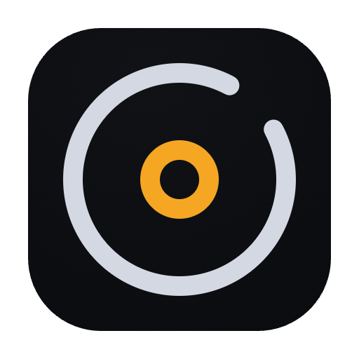

  

<h1 align="center">ORVIK</h1>

> DJ hardware → visuals · lighting · DAW sync (TCNet · Art-Net · LTC · MIDI)

Independent desktop bridge that reads a compatible Pioneer DJ network and turns tempo, beat, position, and track info into synced outputs for visual, lighting, and production software.

> ⚠️ **Beta** — built from independent packet-capture research, not a manufacturer SDK. Bugs are expected. Please report them via [Issues](../../issues).

  
  &nbsp;
  

## Outputs

- **TCNet** — native Resolume Arena sync (up to 6 layers). Confirmed working. Also works with other TCNet software.
- **OSC BPM · Art-Net Timecode · LTC · MIDI Clock · MTC** — for lighting consoles, DAWs, and timecode gear.
- **Virtual Deck** — local 6-deck playback (MP3, WAV, FLAC, AAC, OGG, M4A, AIFF), no hardware needed.
- **Web Viewer** — monitor decks, waveform, cues, and timecode from a phone/tablet browser on the same network.

## Supported hardware

Pioneer DJ:

- CDJ-3000
- CDJ-TOUR1
- CDJ-2000NXS2
- DJM-TOUR1
- DJM-V10-LF
- DJM-V10
- DJM-900NXS2

**Tested on real hardware:**

- CDJ-3000
- CDJ-2000NXS2
- DJM-900NXS2

Other models and newer units (CDJ-3000X, CDJ-1500X) are untested — behavior unknown. LTC / MTC / MIDI Clock / Art-Net Timecode outputs are not yet verified against real receivers. Reports welcome.

## Install

Download for your OS from [Releases](../../releases) — macOS 10.15+ (Intel/Apple Silicon) or Windows 10/11 (x64). Current build is a free demo with all features unlocked.

## Legal

Independent interoperability implementation based on observed network behavior and public information. Not affiliated with, endorsed by, or certified by AlphaTheta / Pioneer DJ or any protocol owner; product names describe compatibility only. See [LICENSE](LICENSE), [BINARY_LICENSE.md](BINARY_LICENSE.md), [NOTICE.md](NOTICE.md), [THIRD_PARTY_NOTICES.md](THIRD_PARTY_NOTICES.md).

---

## 한국어

호환 Pioneer DJ 네트워크를 읽어 템포·비트·위치·트랙 정보를 비주얼/조명/프로덕션 소프트웨어용 동기화 출력으로 변환하는 독립 데스크톱 브리지입니다.

> ⚠️ **베타** — 제조사 SDK가 아닌 독립 패킷 캡쳐 분석 기반이라 버그가 있을 수 있습니다. 문제는 [Issues](../../issues)로 알려주세요.

**출력:** TCNet(Resolume Arena 네이티브 동기화, 확인됨) · OSC BPM · Art-Net Timecode · LTC · MIDI Clock · MTC · Virtual Deck(하드웨어 없이 로컬 재생) · Web Viewer(모바일/태블릿 모니터링).

**지원 기기:**

- CDJ-3000
- CDJ-TOUR1
- CDJ-2000NXS2
- DJM-TOUR1
- DJM-V10-LF
- DJM-V10
- DJM-900NXS2

**실제 검증 모델:**

- CDJ-3000
- CDJ-2000NXS2
- DJM-900NXS2

그 외 모델과 신제품(CDJ-3000X, CDJ-1500X)은 미검증이라 동작을 보장할 수 없고, LTC/MTC/MIDI Clock/Art-Net Timecode 출력도 실제 수신 장비로는 아직 검증하지 못했습니다.

**설치:** [Releases](../../releases)에서 macOS 10.15+ 또는 Windows 10/11용 패키지를 받으세요. 현재는 모든 기능이 열린 무료 데모입니다.

**법적 고지:** 관찰된 네트워크 동작과 공개 정보 기반의 독립 구현이며 AlphaTheta·Pioneer DJ 등 어떤 권리자와도 제휴/인증 관계가 없습니다. 자세한 내용은 [LICENSE](LICENSE), [BINARY_LICENSE.md](BINARY_LICENSE.md), [NOTICE.md](NOTICE.md), [THIRD_PARTY_NOTICES.md](THIRD_PARTY_NOTICES.md) 참고.
