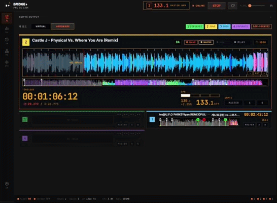
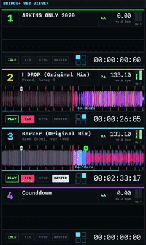

# BRIDGE+

> Independent desktop bridge for synchronizing compatible DJ hardware, virtual decks, visual software, lighting systems, DAWs, and timecode workflows.

BRIDGE+ listens to compatible DJ network state and translates timing, transport, metadata, and deck information into practical outputs for visual, lighting, and production environments.

## Preview

  
  &nbsp;
  

> Demonstration on the developer's own hardware. UI, track names, and colors are examples.

> **Trademark and affiliation notice:** BRIDGE+ is an independent third-party project. It is not affiliated with, endorsed by, sponsored by, approved by, licensed by, certified by, or otherwise officially connected to any hardware, software, or protocol owner mentioned in this repository. Product names, protocol names, and trademarks are used only to describe compatibility and interoperability. See [NOTICE.md](NOTICE.md).

---

## Distribution Model

BRIDGE+ release packages are distributed as desktop binaries for macOS and Windows.
The public GitHub repository contains documentation for the released packages; application source code is maintained separately.

This release is a **demo build with no time limit at this time**. All features are available. A time-limited demo may be introduced in a future release; if that happens, BRIDGE+ will still launch and continue in a limited mode with basic Pro DJ Link to TCNet output.

BRIDGE+ binaries may not be copied, modified, redistributed, mirrored, sold, sublicensed, or reverse engineered except where applicable law cannot restrict those rights.

Donations and sponsorships are voluntary development support. They do not purchase a license, unlock features, transfer ownership, create warranty or support obligations, or grant redistribution, modification, trademark, reverse-engineering, or source-code rights unless a separate written agreement says so.

---

## Features

- **Compatible DJ network receiver** - deck state, tempo, beat, position, track metadata, cue points, beat grids, phrase data, and artwork where available
- **TCNet output** - visual software synchronization with up to 6 layers and bidirectional metadata / metrics
- **OSC BPM Sync** - sends BPM changes to configurable local, unicast, or broadcast OSC targets for tempo-driven visual workflows
- **Art-Net Timecode, LTC, MIDI Clock, and MTC** - synchronization for lighting consoles, DAWs, sequencers, and timecode tools
- **Virtual Deck mode** - local 6-deck playback for MP3, WAV, FLAC, AAC, OGG, M4A, and AIFF files
- **Hardware waveform rendering** - color preview, detail waveform, and 3-band visualization where supported by the source data
- **Web Viewer** - local-network browser view for mobile/tablet monitoring of deck state, waveform, cue markers, mixer state, and timecode

---

## Testing Status

TCNet output, PRO DJ LINK input (CDJ-3000 / CDJ-2000NXS2 / DJM-900NXS2), the Web Viewer, and Virtual Deck mode are regularly verified on real hardware.

**LTC, MTC, MIDI Clock, and Art-Net Timecode outputs have not yet been precisely verified against real receiving equipment** (lighting consoles, DAW sync inputs, LTC readers). The implementations follow the published specifications, but timing offset, frame-rate edge cases, and device-specific quirks may exist. If you use these outputs with real gear, please report results — working or not — via [GitHub Issues](../../issues). Include your receiving device model, frame rate, and a short description; logs from the app help a lot.

---

## System Requirements

- **macOS** 10.15+ (x64 / arm64) or **Windows** 10/11 (x64)
- Compatible DJ hardware on the same LAN, or Virtual Deck mode
- Network interface access for the DJ / lighting / visual software network

---

## Installation

Download the native package for your operating system from [Releases](../../releases):

- **macOS Apple Silicon**: `BRIDGE+-1.3.5-mac-arm64.dmg`
- **macOS Intel**: `BRIDGE+-1.3.5-mac-x64.dmg`
- **Windows x64**: `BRIDGE+-1.3.5-win-x64.exe`

Install or run the downloaded package. No separate runtime installation is required for normal use.

---

## Modes

### Virtual Mode

Use local audio files without external hardware. Virtual Deck mode can drive TCNet, OSC BPM Sync, Art-Net Timecode, LTC, and MIDI for testing, rehearsal, and production setup.

### Hardware Mode

Detect compatible DJ players and mixers on the network, then forward timing, transport, mixer, metadata, cue, waveform, artwork, and OSC BPM output where available from the connected system.

---

## Legal Notes

- **Public repository license:** [BRIDGE+ Public Repository License](LICENSE)
- **Binary license:** [BRIDGE+ Binary License Agreement](BINARY_LICENSE.md)
- **Trademark, protocol, third-party asset, and disclaimer notices:** [NOTICE.md](NOTICE.md), [THIRD_PARTY_NOTICES.md](THIRD_PARTY_NOTICES.md)
- **Release history:** [CHANGELOG.md](CHANGELOG.md)

GitHub's automatically generated "Source code" archives contain this public documentation repository only. Installable BRIDGE+ packages are the release assets listed above.

BRIDGE+ is an independent interoperability implementation based on observed network behavior and publicly available information. No proprietary source code, firmware, or confidential materials from any manufacturer were used to develop this project.

BRIDGE+ is not AlphaTheta's official PRO DJ LINK Bridge application, is not a PRO DJ LINK licensed company product, and is not certified by AlphaTheta, Pioneer DJ, TC Supply, Event Imagineering Group, ShowKontrol, or any related party.

Users are responsible for ensuring that their use of BRIDGE+ complies with applicable laws, third-party licenses, device terms, and venue or production requirements in their jurisdiction.

---

## Korean

> 호환 DJ 하드웨어, Virtual Deck, 비주얼 소프트웨어, 조명 시스템, DAW, 타임코드 워크플로를 동기화하기 위한 독립 데스크톱 브리지입니다.

BRIDGE+는 호환 DJ 네트워크 상태를 수신하고, 타이밍 / 재생 상태 / 메타데이터 / 덱 정보를 비주얼, 조명, 프로덕션 환경에서 사용할 수 있는 출력으로 변환합니다.

> **상표 및 비제휴 고지:** BRIDGE+는 독립 서드파티 프로젝트입니다. 이 저장소에 언급된 어떤 하드웨어, 소프트웨어 또는 프로토콜 권리자와도 제휴, 승인, 후원, 라이선스, 인증 또는 공식 연결 관계가 없습니다. 제품명, 프로토콜명, 상표는 호환성 및 상호운용성 설명을 위한 목적으로만 사용됩니다. 자세한 내용은 [NOTICE.md](NOTICE.md)를 확인하세요.

### 배포 모델

BRIDGE+ 릴리스 패키지는 macOS 및 Windows용 데스크톱 바이너리로 배포됩니다.
공개 GitHub 저장소에는 릴리스 패키지 설명을 위한 문서만 포함되며, 애플리케이션 소스 코드는 별도로 관리됩니다.

이 릴리스는 **현재 기간 제한이 없는 데모 빌드**입니다. 모든 기능을 사용할 수 있습니다. 향후 릴리스에서 기간 제한 데모가 도입될 수 있으며, 그 경우에도 BRIDGE+ 실행 자체는 차단되지 않고 기본 Pro DJ Link → TCNet 출력의 제한 모드로 계속 작동합니다.

BRIDGE+ 바이너리는 관련 법률상 제한할 수 없는 경우를 제외하고 복사, 수정, 재배포, 미러링, 판매, 재라이선스, 리버스 엔지니어링이 금지됩니다.

도네이션과 후원은 자발적인 개발 지원입니다. 별도 서면 계약이 없는 한 라이선스 구매, 기능 해금, 소유권 이전, 보증/지원 의무, 재배포 권한, 수정 권한, 상표 권한, 리버스 엔지니어링 권한, 소스 코드 권한을 의미하지 않습니다.

### 주요 기능

- **호환 DJ 네트워크 수신** - 덱 상태, 템포, 비트, 위치, 트랙 메타데이터, 큐 포인트, 비트 그리드, 구간 정보, 앨범아트 수신
- **TCNet 출력** - 최대 6 레이어 비주얼 소프트웨어 동기화 및 양방향 메타데이터 / 메트릭스 전송
- **OSC BPM Sync** - BPM 변화값을 로컬, 유니캐스트, 브로드캐스트 OSC 대상으로 송신해 템포 기반 비주얼 워크플로에 사용
- **Art-Net Timecode, LTC, MIDI Clock, MTC** - 조명 콘솔, DAW, 시퀀서, 타임코드 장비 동기화
- **Virtual Deck 모드** - MP3, WAV, FLAC, AAC, OGG, M4A, AIFF 파일을 사용하는 로컬 6덱 재생
- **하드웨어 웨이브폼 렌더링** - 소스 데이터가 제공되는 경우 컬러 프리뷰, 디테일 웨이브폼, 3밴드 시각화
- **Web Viewer** - 같은 네트워크의 모바일/태블릿 브라우저에서 덱 상태, 웨이브폼, 큐 마커, 믹서 상태, 타임코드 확인

### 테스트 현황

TCNet 출력, PRO DJ LINK 입력(CDJ-3000 / CDJ-2000NXS2 / DJM-900NXS2), Web Viewer, Virtual Deck 모드는 실제 하드웨어에서 상시 검증하고 있습니다.

**LTC, MTC, MIDI Clock, Art-Net Timecode 출력은 아직 실제 수신 장비(조명 콘솔, DAW 싱크 입력, LTC 리더 등)로 정밀 검증하지 못했습니다.** 구현은 공개 규격을 따르지만 타이밍 오프셋, 프레임레이트 엣지 케이스, 장비별 특성 문제가 있을 수 있습니다. 이 출력들을 실제 장비와 사용해 보신 분은 정상 동작 여부와 관계없이 [GitHub Issues](../../issues)로 알려주세요. 수신 장비 모델, 프레임레이트, 간단한 상황 설명과 함께 앱 로그를 첨부해 주시면 큰 도움이 됩니다.

### 시스템 요구사항

- **macOS** 10.15+ (x64 / arm64) 또는 **Windows** 10/11 (x64)
- 같은 LAN에 연결된 호환 DJ 하드웨어 또는 Virtual Deck 모드
- DJ / 조명 / 비주얼 소프트웨어 네트워크에 접근 가능한 네트워크 인터페이스

### 설치

[Releases](../../releases)에서 운영체제에 맞는 네이티브 패키지를 다운로드하세요.

- **macOS Apple Silicon**: `BRIDGE+-1.3.5-mac-arm64.dmg`
- **macOS Intel**: `BRIDGE+-1.3.5-mac-x64.dmg`
- **Windows x64**: `BRIDGE+-1.3.5-win-x64.exe`

다운로드한 패키지를 설치하거나 실행하면 됩니다. 일반 사용에는 별도 런타임 설치가 필요하지 않습니다.

### 모드

#### Virtual Mode

외부 하드웨어 없이 로컬 오디오 파일을 사용합니다. Virtual Deck 모드는 테스트, 리허설, 프로덕션 세팅을 위해 TCNet, OSC BPM Sync, Art-Net Timecode, LTC, MIDI를 구동할 수 있습니다.

#### Hardware Mode

네트워크의 호환 DJ 플레이어와 믹서를 감지하고, 연결된 시스템에서 제공되는 타이밍, 재생 상태, 믹서, 메타데이터, 큐, 웨이브폼, 앨범아트, OSC BPM 출력을 전달합니다.

### 법적 고지

- **공개 저장소 라이선스:** [BRIDGE+ Public Repository License](LICENSE)
- **바이너리 라이선스:** [BRIDGE+ Binary License Agreement](BINARY_LICENSE.md)
- **상표, 프로토콜, 서드파티 자산, 면책 고지:** [NOTICE.md](NOTICE.md), [THIRD_PARTY_NOTICES.md](THIRD_PARTY_NOTICES.md)
- **릴리스 내역:** [CHANGELOG.md](CHANGELOG.md)

GitHub가 자동 생성하는 "Source code" 압축 파일에는 이 공개 문서 저장소만 포함됩니다. BRIDGE+ 설치 파일은 위에 표시된 릴리스 파일을 다운로드해 사용하세요.

BRIDGE+는 관찰된 네트워크 동작과 공개 정보를 기반으로 한 독립 상호운용성 구현입니다. 이 프로젝트를 개발하는 과정에서 어떤 제조사의 비공개 소스 코드, 펌웨어, 기밀 자료도 사용하지 않았습니다.

BRIDGE+는 AlphaTheta의 공식 PRO DJ LINK Bridge 애플리케이션이 아니며, PRO DJ LINK 라이선스 회사 제품이 아니고, AlphaTheta, Pioneer DJ, TC Supply, Event Imagineering Group, ShowKontrol 또는 관련 당사자의 인증을 받은 제품이 아닙니다.

사용자는 BRIDGE+ 사용이 본인 관할 지역의 관련 법률, 제3자 라이선스, 장비 약관, 공연장 또는 프로덕션 요구사항을 준수하는지 직접 확인할 책임이 있습니다.
